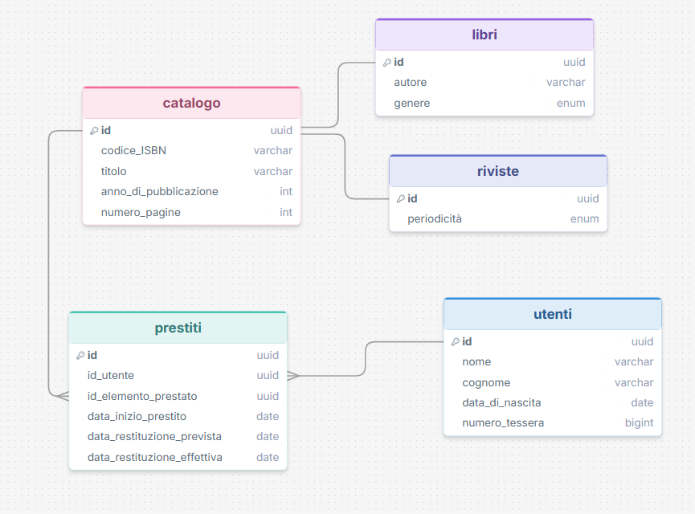
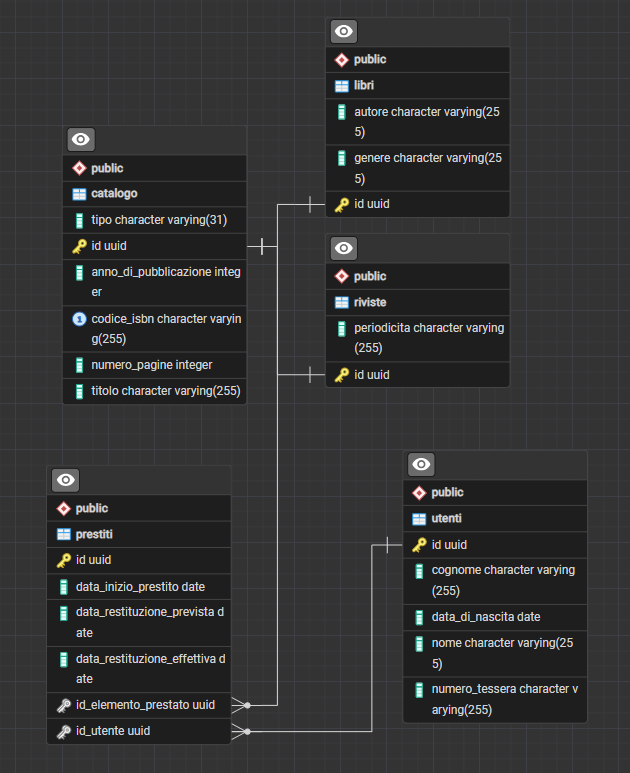

Screen diagramma fatto su drawsql

Un utente specifico puo avere più prestiti, ma un prestito specifico non può avere più utenti. Quindi relazione
presiti-utenti(Many To One).

Un elemento specifico (libro o rivista), può essere prestato più volte. Ma un singolo prestito è legato solo ad un libro
specifico(Many To One).

Il catalogo è la classe padre, che ha come figli Libri e Riviste.

Screen di pgAdmin
